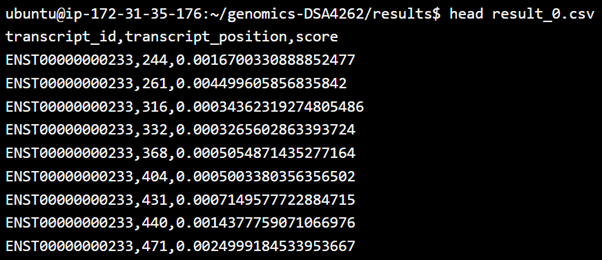

# DSA4262-proj-genericteam
NUS DSA4262 Genomics Project

### Purpose of software
An example of post-transcriptional modification is m6A modification, where a methyl group is added to an adenosine molecule which results in a change of chemical structure. Such modification plays an important rule in cellular fate governance and cellular processes; and it can also be linked to life-threatening diseases like cancer. The nanopore direct RNA sequencing technology captures information such as the direct RNA current for each RNA module, the standard deviation and the dwelling time of the molecule as it passes through a nanopore. This script includes the model training process to develop a supervised machine learning model to predict the m6A modification sites. A sample train and test dataset is provided to run the model and evaluate its performance.


### Installation and Execution
- Step 1: Launch AWS and navigate to your home directory using the command: ``` $ cd ~ ```
- Step 2: Create a virtual envionment by running the following bash commands:
  - Install pip ``` $ sudo apt-get install python3-pip ```
  - Intall virtualenv ``` $ sudo pip3 install virtualenv ```
  - Check that you have downloaded virtualenv using the command: ``` $ virtualenv --version ```
  - Replace 'venv name' with a name for your virtual environment.``` $ virtualenv 'venv name' ```
  - Activate your virtual envionment ``` $ source 'venv name'/bin/activate ```
- Step 3: git clone this repository using the command: ``` $ git clone https://github.com/sanrajmitra97/genomics-DSA4262.git ```
  - If for any reason the above command returns a "fatal error" when cloning, try this command instead: ``` $ git clone --depth 1 https://github.com/sanrajmitra97/genomics-DSA4262.git ```. Some machines may face the error when cloning, but not all. 
- Step 4: Locate the requirements.txt file and run the following command: ``` $ pip install -r /path/to/requirements.txt ```
- Step 5: Once done, cd to the src folder: ``` $ cd src ```
- To run the test script, proceed to step 7. If you would like to run the training script, proceed to step 6. 
- Step 6: Run the following command: ``` $ python train_model.py ```
  - You will be prompted to add a name for the model. Feel free to add any name for the model. For example, "model1". 
  - The results of the model's training performance will also be printed. 
  - This model is also saved in a "models" folder in the parent directory of src.
- Step 7: Run the following command while still in the src folder: ``` $ python make_pred.py ```
  - If you ran step 6, the model trained in step 6 will be used for making predictions on a small test dataset.
  - If you skipped to step 7, the model used to make predictions is already located in the models folder. 
- Step 8: The predictions of the test dataset will be located in a folder called 'Results' in the parent directory of src. 

 ### Interpretation
 To view the results, we can use the head command to view the prediction results. Navigate to the results folder and type the following: ``` $ head results_0.csv ```
  <br />
 The first column shows the transcript_id, the second column shows the transcript_position and the third column shows the predicted score of m6A modification. A higher score denotes a higher probability of the site containing an m6A modification.
